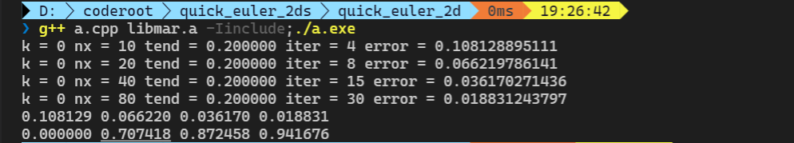
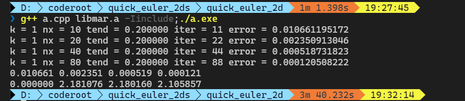
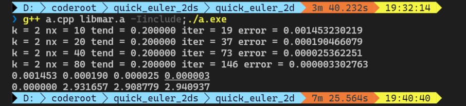
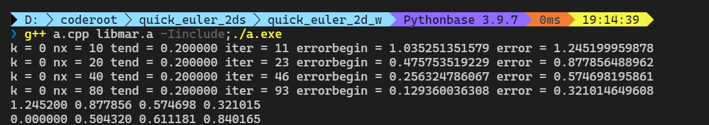
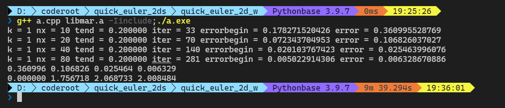
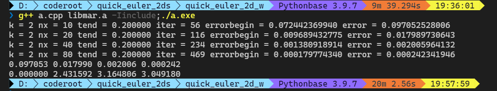
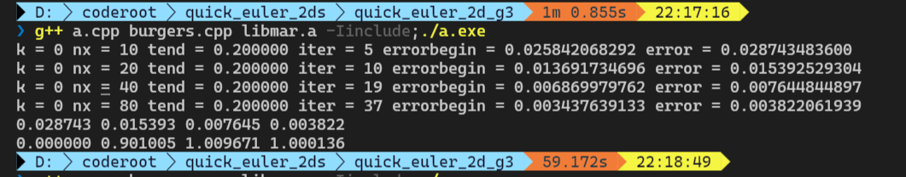
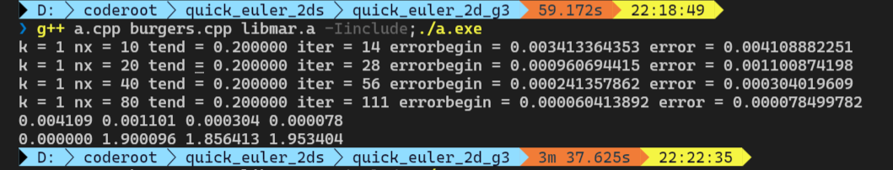
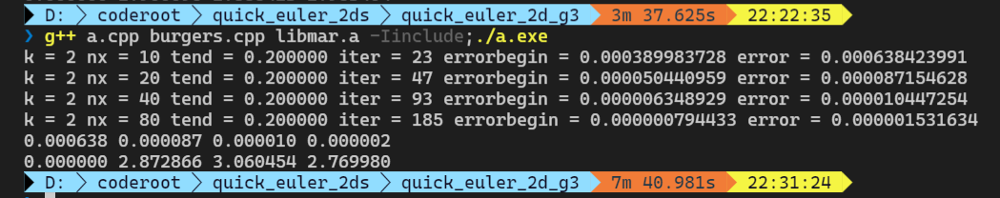

# 欧拉方程组 2d 实验

二维的欧拉方程组形式为
$$
\begin{aligned}
U_t + f(U)_x + g(U)_y &= 0
\end{aligned}
$$
其中
$$
\begin{aligned}
U=
\begin{pmatrix}
\xi_1\\
\xi_2\\
\xi_3\\
\xi_4
\end{pmatrix}
=
\begin{pmatrix}
\rho\\
\rho u\\
\rho v\\
\frac{p}{\gamma-1} + \frac12 \rho u^2 + \frac12 \rho v^2
\end{pmatrix}\\
f(U) = 
\begin{pmatrix}
\rho u\\
\rho u^2 + p\\
\rho u v\\
u(\frac{\gamma}{\gamma-1}p + \frac12 \rho u^2 + \frac12 \rho v^2)
\end{pmatrix}\\
g(U) =
\begin{pmatrix}
\rho v\\
\rho u v\\
\rho v^2 + p\\
v(\frac{\gamma}{\gamma-1}p + \frac12 \rho u^2 + \frac12 \rho v^2)
\end{pmatrix}
\end{aligned}
$$
守恒型变量$U$与原始的变量$(\rho,u,v,p)^T$之间存在转换关系
$$
\begin{aligned}
\begin{pmatrix}
\rho\\
u\\
v\\
p\\
\end{pmatrix}
&=
\begin{pmatrix}
\xi_1\\
\xi_2/\xi_1\\
\xi_3/\xi_1\\
(\gamma-1)(\xi_4 - \frac12 \frac{\xi_2^2}{\xi_1}-\frac12 \frac{\xi_3^2}{\xi_1})
\end{pmatrix}\\
U=
\begin{pmatrix}
\xi_1\\
\xi_2\\
\xi_3\\
\xi_4
\end{pmatrix}
&=
\begin{pmatrix}
\rho\\
\rho u\\
\rho v\\
\frac{p}{\gamma-1} + \frac12 \rho u^2 + \frac12 \rho v^2
\end{pmatrix}\\
\end{aligned}
$$

$f$对应的Jacobi矩阵的特征值为$u-c,u,u,u+c$，$g$对应的Jacobi矩阵的特征值为$v-c,v,v,v+c$，其中$c^2=\gamma \frac{p}{\rho}$。

### 算例一 连续解

区域$[0,2]^2$，周期性边界条件，初值
$$
\left\{
\begin{aligned}
\rho(x,y,0)&=1+0.2\sin(\pi (x+y))\\
u(x,y,0)&=0.7\\
v(x,y,0)&=0.3\\
p(x,y,0)&=1\\
\end{aligned}
\right.
$$
精确值
$$
\left\{
\begin{aligned}
\rho(x,y,t)&=1+0.2\sin(\pi [(x+y) - (u+v)t])\\
u(x,y,t)&=0.7\\
v(x,y,t)&=0.3\\
p(x,y,t)&=1\\
\end{aligned}
\right.
$$
数值解结果如下图，最后两行依次是误差和误差的阶数。

### 算例二 旋涡

首先背景是一个沿对角线方向的均匀流动，区域为$[a,b]^2$，周期边界条件。
$$
(u_0,v_0)=1\\
\rho_0 = 1\\
p_0=1
$$
在区域的中心$(\frac{a+b}2,\frac{a+b}2)$加上一个旋涡的扰动，其中热力学量$T=\frac{p}{\rho}$，$S=\frac{p}{\rho^{\gamma}}$，
$$
\begin{aligned}
\begin{pmatrix}
\delta u\\
\delta v
\end{pmatrix}
&= \frac{\epsilon}{2\pi} \exp(0.5(1-r^2))\begin{pmatrix}
-\bar{y}\\
\bar{x}
\end{pmatrix}
\\
\delta T &= -\frac{(\gamma-1) \epsilon^2}{8\gamma \pi^2} \exp(1-r^2)\\
\delta S &= 0
\end{aligned}
$$
其中
$$
(\bar{x},\bar{y}) = (x-\frac{a+b}2,y-\frac{a+b}2)\\
r^2 = \bar{x}^2 + \bar{y}^2
$$
取常数$\epsilon=5$，区域$[0,10]^2$。

再计算压强和密度的扰动，由于
$$
\left\{
\begin{aligned}
\frac{T^\gamma}{S}&= p^{\gamma-1} \\
\frac{T}{S} &= \rho^{\gamma-1}\\
\end{aligned}
\right.
\rightarrow
\left\{
\begin{aligned}
p &= \left( \frac{T^\gamma}{S} \right)^{\frac{1}{\gamma-1}}\\
\rho &= \left( \frac{T}{S} \right)^{\frac{1}{\gamma-1}}\\
\end{aligned}
\right.
$$
从而
$$
\left\{
\begin{aligned}
\rho=\rho_0 + \delta \rho &= \left( \frac{T_0+\delta T}{S_0+\delta S} \right)^{\frac{1}{\gamma-1}}
=\left(1+\delta T\right)^{\frac{1}{\gamma-1}}\\\
p = p_0 + \delta p &= \left( \frac{(T_0+\delta T)^\gamma}{S_0+\delta S} \right)^{\frac{1}{\gamma-1}} = 
 \left(1+\delta T\right)^{\frac{\gamma}{\gamma-1}}
\end{aligned}
\right.
$$
精确解采用旋涡的直接平移获得，旋涡中心将从中心点(5,5)出发，沿着对角线运动，在$t$时刻到达$(5+t,5+t)$位置。

数值解的结果如下图：取短时间 $t=0.2$，最后两行依次是误差和误差的阶数。

### 算例三 $\gamma=3$ 算例

区域$[0,4\pi]^2$，$\gamma=3$，周期性边界条件，初值
$$
\left\{
\begin{aligned}
\rho(x,y,0)&=\frac{1+0.2\sin((x+y)/2)}{\sqrt{6}}\\
u(x,y,0)&=v(x,y,0)=\sqrt{\frac{\gamma}{2}} \rho(x,y,0)\\
p(x,y,0)&=\left[\rho(x,y,0)\right]^\gamma\\
\end{aligned}
\right.
$$
精确值通过burgers方程得到
$$
\left\{
\begin{aligned}
\rho(x,y,t)&\\
u(x,y,t)&=v(x,y,0)=\sqrt{\frac{\gamma}2} \rho(x,y,t)\\
p(x,y,t)&=[\rho(x,y,t)]^\gamma\\
\end{aligned}
\right.
$$
其中$\rho(x,y,t) = \frac{1}{\sqrt6} \mu(x,y,t)$，$\mu$满足二维的burgers方程：
$$
\left\{
\begin{aligned}
\mu_t + \frac12 (\mu^2)_x + \frac12 (\mu^2)_y=0\\
\mu(x,y,0) = 1+0.2 \sin((x+y)/2)
\end{aligned}
\right.
$$

直到$T_b=5$精确解都仍然连续，我们取$t=0.2$测试。

数值解结果如下图，最后两行依次是误差和误差的阶数。

