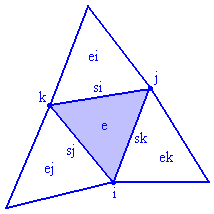
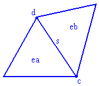

# 三角网格

参考链接 [EasyMesh (mit.edu)](http://web.mit.edu/easymesh_v1.4/www/output.html)

但是源文件无法下载了。

## .n [node] 结点文件

第一行：结点总数

接下来每一行：

```
结点编号，结点x坐标，结点y坐标，结点的标记

<node number:> <x> <y> <marker>
```


注意，最后的点的标记位置，标记为0说明点在内部，标记为1说明点在边界。


## .e [element] 单元文件

第一行：单元总数

单元包含三个结点，结点编号为i，j，k，按照逆时针排列，结点和对边也有对应

接下来每一行：

```
单元编号，三个结点编号，三个相邻单元的编号，三个边的编号，一个圆心坐标，单元的标记

<element number:> <i> <j> <k> <ei> <ej> <ek> <si> <sj> <sk> <xV> <yV> <marker>
```





当前的网格文件，单元的标记位全都是-1，因此没有信息。

注意：存在边界的三角单元，对应的单元编号记作 -1


## .s [side] 边文件

第一行：边总数

接下来的每一行：

```
边的编号，两个顶点的编号，两个单元的编号，边的标记

 <side number:> <c> <d> <ea> <eb> <marker>
```

注意，如果边的一侧是边界，则对应单元编号记作-1，并且最后标志位记作1。

如果边不是边界的，则标志位是0。

